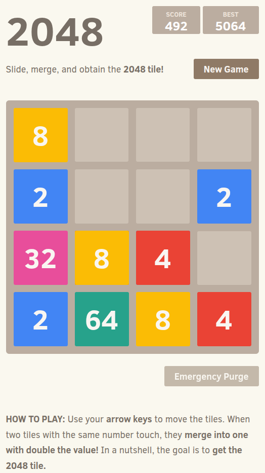

# 2048
A clone of [2048 by Gabriele Cirulli](https://github.com/gabrielecirulli/2048)

A lot of the code is the same as the original, but a few features have been added. I would appreciate any contributors reporting bugs or opening pull requests.

You can play the game [here](https://meolar.github.io/2048).

### Screenshot

  

## Contributing
Changes and improvements are more than welcome! Feel free to fork and open a pull request. Please make your changes in a specific branch and request to pull into `master`! If you can, please make sure the game fully works before sending the PR, as that will help speed up the process.

You can find the same information in the [contributing guide.](https://github.com/meolar/2048/blob/master/CONTRIBUTING.md)
